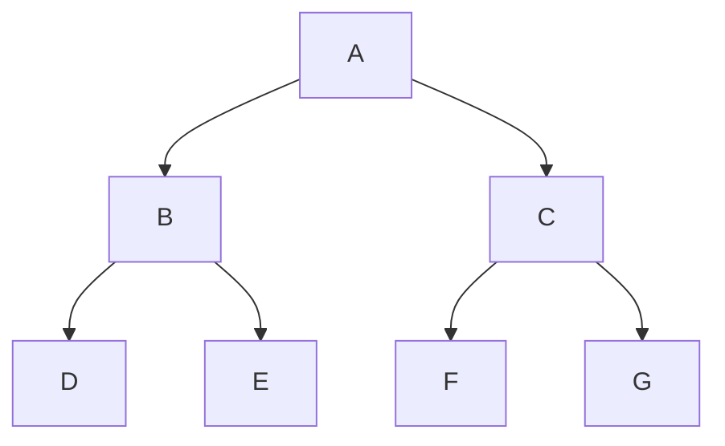
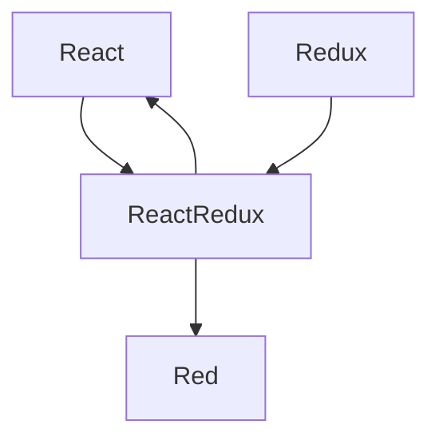

# React Redux

### What is redux?
Redux is a predictable state container for JavaScript app

- It's for JavaScript apps
- It's a state container
- It's predictable
---
### For js applications

Redux is not tied to React.

It can be used with React, Angular, Vue or even vanilla JavaScript.
It is a library for js applications

---
### Redux is a state container

Redux stores the state of your application

Consider a React app - state of a component

|**LoginFormComponent**|
|:---------------------|
| State={              |
|   username: ' ',     |
|   password: ' ',     |
|   submitting: false }|

The state of this component is simple an object with `username`, `password` and a `submitting` flag

The state of an application is simple the state represented by all the individual components of that application. This includes the data and the UI logic and Redux will store and manager this application state

---
### Redux is predictable
#### Predictable why?
Redux is a state container

The state of the application can change.

```Ex: Todo list app -- item (pending) -> item(completed)```

In redux, all state transitions are explicit and it is possible to keep track of them. The changes to your application's state become predictable

---
### Why Redux?
Manage the state of your application in a  predictable way, redux can help you.

---
### React + Redux?
- Why would we want to use redux in a react application?
- Components in react have their own state
- Why do we need another tool to help manage that state?

#### Considering a react app




To have an information shared from `G` to `F` we need to lift the component state to `C`. The state now will be managed in the component `C` which then, provides data and methods as props to components `G` and `F`.

Now you find out that the component `D` also needs the same information. The solution again is to lift the state up. The state now is managed in the component `A` and you will have to pass the state as props for components that doesn't need.

Imagine now a bigger project. 

As you can see, it's not that easy or simple to manage all the level.

Using using Redux, the state is contained outside your components.

If `G` updates the state, it will comunicate with the state container and the state container, as a predictable manner, will send this values to only those components that are in need of that value.

---

React-Redux is the official library for Redux in React. It offers a couple of functions that can be used to help you connect the React Aplication with Redux.
