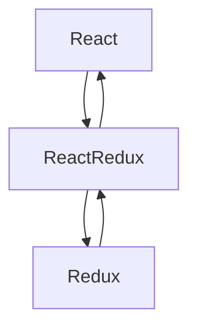
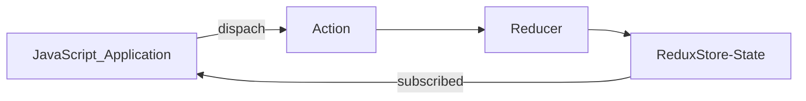

# React Redux

### What is redux?

Redux is a predictable state container for JavaScript app

- It's for JavaScript apps
- It's a state container
- It's predictable

---

### For js applications

Redux is not tied to React.

It can be used with React, Angular, Vue or even vanilla JavaScript.
It is a library for js applications

---

### Redux is a state container

Redux stores the state of your application

Consider a React app - state of a component

| **LoginFormComponent** |
| :--------------------- |
| State={                |
| username: ' ',         |
| password: ' ',         |
| submitting: false }    |

The state of this component is simple an object with `username`, `password` and a `submitting` flag

The state of an application is simple the state represented by all the individual components of that application. This includes the data and the UI logic and Redux will store and manager this application state

---

### Redux is predictable

#### Predictable why?

Redux is a state container

The state of the application can change.

`Ex: Todo list app -- item (pending) -> item(completed)`

In redux, all state transitions are explicit and it is possible to keep track of them. The changes to your application's state become predictable

---

### Why Redux?

Manage the state of your application in a predictable way, redux can help you.

---

### React + Redux?

- Why would we want to use redux in a react application?
- Components in react have their own state
- Why do we need another tool to help manage that state?

#### Considering a react app


To have an information shared from `G` to `F` we need to lift the component state to `C`. The state now will be managed in the component `C` which then, provides data and methods as props to components `G` and `F`.

Now you find out that the component `D` also needs the same information. The solution again is to lift the state up. The state now is managed in the component `A` and you will have to pass the state as props for components that doesn't need.

Imagine now a bigger project.

As you can see, it's not that easy or simple to manage all the level.

Using using Redux, the state is contained outside your components.

If `G` updates the state, it will comunicate with the state container and the state container, as a predictable manner, will send this values to only those components that are in need of that value.

---



React-Redux is the official library for Redux in React. It offers a couple of functions that can be used to help you connect the React Aplication with Redux.

---

### Three Core Concepts

| **Cake Shop Scenario** | **Redux** | **Purpose**                         |
| ---------------------- | --------- | ----------------------------------- |
| Shop                   | Store     | Holds the state of your application |
| Intention to BUY_CAKE  | Action    | Describes what happened             |
| Shopkeeper             | Reducer   | Ties the store and actions together |

`Store`: holds the state of your application

`Action`: describes the changes in the state of the application

`Reducer`: actually carries out the state transition depending on the action

### Three Pinciples

> #### First principle
>
> ---
>
> The state of your whole application is stored in an object tree within a single store
>
> - Maintain our application state in a single object which would be managed by Redux store

> #### Second principle
>
> ---
>
> The only way to change the state is to emit an action, an object decribing what happened
>
> - To update the state of your app, you need to let Redux know about that with an action
> - Not allowed to directly update the state object

> #### Third principle
>
> ---
>
> To specify how the state tree is transformed by action, you write pure reducers
>
> - Reducer - `(previousState, action) => newState`

```javascript
const reducer = (state, action) => {
  switch (action.type) {
    case BUY_CAKE:
      return {
        numOfCakes: state.numOfCakes - 1,
      };
  }
};
```



---

### Middleware

#### It is the suggested way to extend Redux with custom functionality

- It provides a third-party extesion point between dispatching an action, and the moment it reaches the reducer
- Use middleware for logging, crash reporting, performing asynchronos tasks etc

#### Logging

Using the package `redux-logger`

1. Install the redux-logger
2. Import/Require the library
3. Apply the middleware
   ```javascript
   const applyMiddleware = redux.applyMiddleware;
   ```
4. Create the logger
   ```javascript
   const logger = reduxLogger.createLogger();
   ```
5. Pass the middleware to your store
   ```javascript
   const combinedStore = createStore(rootReducer, applyMiddleware(logger));
   ```

#### Asynchronos tasks

Async API calls to fetch data from an end point and use that data in your application

For this we are gonna create another application

**Our Application**

Fetches a list of users from an API end point and stores it in the redux store.

- State? (how it will looks like)
- Actions? (what are the different actions)
- Reducer? (how it would work)

#### State

```json
state={
    loading: true,
    data: [],
    error: ''
}
```

`loading` - Will help to display loading spinner in your component for example

`data` - List of users

`error` - Display error to the user

#### Actions

It will be three

- FETCH_USERS_REQUEST
  - Will fetch the list of users
- FETCH_USERS_SUCCESS
  - Fetched successfully
- FETCH_USERS_FAILURE
  - Error fetching the data

#### Reducers

> case: FETCH_USERS_REQUEST
>
> > loading: true

> case: FETCH_USERS_SUCCESS
>
> > loading: false
> >
> > users: data (from API)

> case: FETCH_USERS_FAILURE
>
> > loading: false
> >
> > error: error (from API)

---

### Async Action creators

We are gonna use two packages

> **axios**
>
> used to create requests to an API end

> **redux-thunk**
>
> package from redux echosystem and it is the standard way to `define async actions creator` in your application
>
> basecally it is a middleware that will be applied to our store

install the two packages
```bash
$ npm install axios redux-thunk
```
